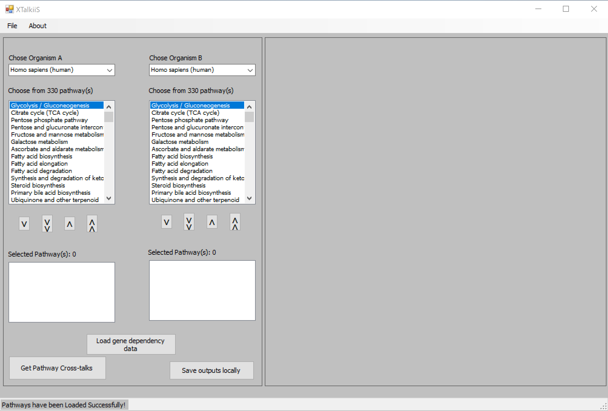
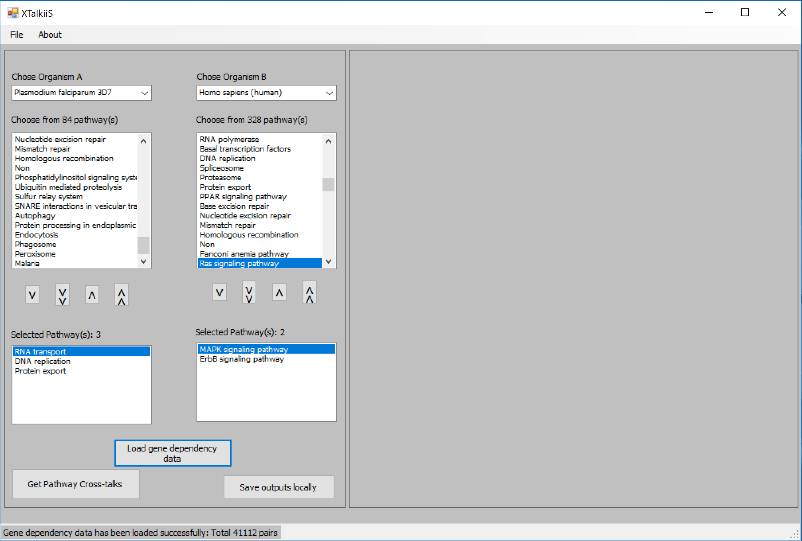
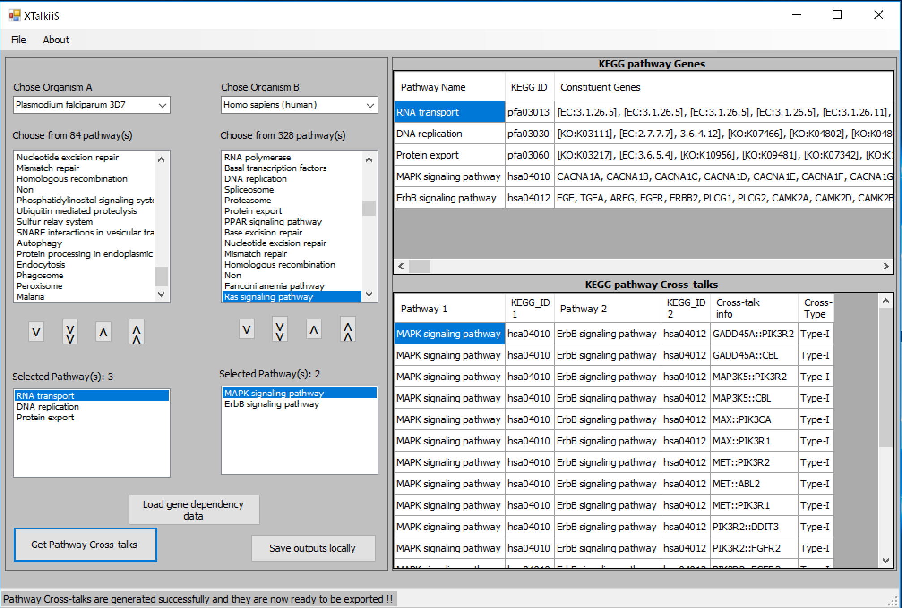

# XTalkiiS: a tool for finding data-driven cross-talks between intra-/inter-species pathways 

## Introduction
Cell-cell communication via pathway cross-talks within a single species have been studied in silico recently to decipher various disease phenotype. However, computational prediction of pathway cross-talks among multiple species in a data-driven manner is yet to be explored. In this article, I present XTalkiiS (Cross-talks between inter-/intra species pathways), a tool to automatically predict pathway cross-talks from data-driven models of pathway network, both within the same organism (intra-species) and between two organisms (inter-species). XTalkiiS starts with retrieving and listing up-to-date pathway information in all the species available in KEGG database using RESTful APIs (exploiting KEGG web services) and an in-house built web crawler. I hypothesize that data-driven network models can be built by simultaneously quantifying co-expression of pathway components (i.e. genes/proteins) in matched samples in multiple organisms. Next, XTalkiiS loads a data-driven pathway network and applies a novel cross-talk modelling approach to determine interactions among known KEGG pathways in selected organisms. The potentials of XTalkiiS are huge as it paves the way of finding novel insights into mechanisms how pathways from two species (ideally host-parasite) may interact that may contribute to the various phenotype of interests such as malaria disease. 

## Download [Stand-alone Tool]
XTalkiiS is freely available for download from https://sourceforge.net/projects/xtalkiis/.

## Citation
```
@article {Azad437541,
	author = {Azad, A. K. M.},
	title = {XTalkiiS: a tool for finding data-driven cross-talks between intra-/inter-species pathways},
	elocation-id = {437541},
	year = {2018},
	doi = {10.1101/437541},
	publisher = {Cold Spring Harbor Laboratory},
	eprint = {https://www.biorxiv.org/content/early/2018/10/13/437541.full.pdf},
	journal = {bioRxiv}
}
```
## Features
- Pathway cross-talk
- inter-species cross-talk
- intra-species cross-talk
- KEGG pathway gene

## Demo



